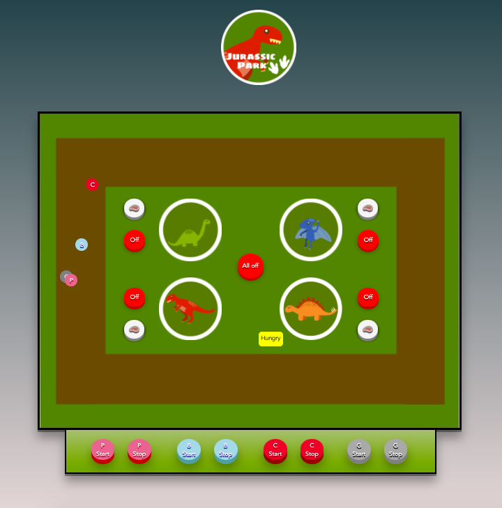

# Jurassic Park User Interface Prototype

#### I created a prototype of an interface for a Jurassic Park employee to control various automated features of the theme park. This project includes HCI techniques such as strong affordances, feedback, mapping, constraints, mental models, information architecture, and user testing. 

#### Using Javascript, JQuery, HTML, CSS, and user feedback, I've iterated on my design to improve its usability. Here is a screeshot of the
iterative project

#### I have tested this interface with real users, and have thought about human perception, psychology, and how they interpret interfaces from an emotional and aesthetic standpoint.

# User Evaluation Write-up

#### After explaining the interface to my participant, she was able to figure things out easily. She was able to perform all the tasks I asked her. I asked her four questions which were. “Using this inter- face stop the pink car”, ”Using this interface feed a hungry animal”, "Using this interface Turn all the pens on”, "Using this interface stop the blue car near a dinosaur of your desire”. She was able to perform all the tasks successfully, but one of the things she pointed out was the size of the feed buttons, which didn't prominently stand out in my interface. She also pointed out the colors of the two cars, which were Lightsteelblue and Light blue, as they look somewhat similar to one another. Moreover, one of the things that annoyed my user, as well as, myself was the fact that the “hungry” popup stays active, even when we clicked on the feed button, for some time.
#### Furthermore, after considering the feedback you have given me, as well as after my user evalua- tion, I have altered a few things in my interface. I have tried to make the feed buttons larger to accommodate the Fitt’s law, which can accurately predict the amount of time taken to move to and select a target. I, also, improved the mapping present in my interface, which makes the selec- tions of the things easier. I also changed the button text for when the user clicks on all the fences are on or not, which you pointed out would be a problematic thing in the real world Jurassic park. I changed the position of the cars’ start/stop buttons closer to the screen, which would re- duce a lot of eye travel around the screen. I also used different colors for two of the resembling cars, to make it easy for the user to understand the difference. Moreover, I didn’t use the toggle buttons, as you suggested instead of cars’ start/stop buttons because I feel like it would be easier for any user to use the buttons with words on it than just the alteration of color, which would en- able the colorblind people to use the interface successfully.
#### I also considered the interface for the people who are color blind, so I implemented a letter on the top of the cars which resembles the color of the cars. I changed the logo of my interface as it didn't quite connect to the whole interface, now it looks much better and looks something related to the main interface.
#### I also made the "hungry" popups and "animal is fed" popups disappear after a certain period of time, which is not an annoying thing anymore. I managed to change the home page according to your feedback and I think it looks more formed than it was before and a little more connected to the main interface. I think now my interface looks a little more composed and more responsive than before. I tried to make the design more consistent than before. These are few of the things that I strived to alter in the final revision of my interface.

# Authors
**Isha Sharma**
